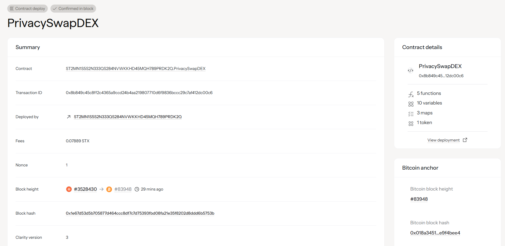

# PrivacySwap DEX

## Project Description

PrivacySwap DEX is an innovative anonymous trading protocol built on the Stacks blockchain that leverages zero-knowledge proof concepts to provide complete privacy for cryptocurrency trading. Unlike traditional decentralized exchanges that expose wallet addresses and transaction amounts on-chain, PrivacySwap ensures that all trading activities remain completely anonymous while maintaining the security and decentralization benefits of blockchain technology.

The protocol implements a commitment-nullifier scheme where users create cryptographic commitments for their trades without revealing sensitive information such as wallet addresses, trade amounts, or trading patterns. This revolutionary approach to decentralized trading ensures that users can maintain their financial privacy while participating in the DeFi ecosystem.

## Project Vision

Our vision is to create the world's first truly private decentralized exchange that empowers users to trade cryptocurrencies without compromising their financial privacy. We believe that privacy is a fundamental right, and financial transactions should remain confidential while still benefiting from the transparency and security of blockchain technology.

PrivacySwap aims to become the go-to platform for privacy-conscious traders, institutional investors, and anyone who values financial confidentiality. We envision a future where users can:

- **Trade with Complete Anonymity**: Execute swaps without revealing wallet addresses or transaction amounts
- **Maintain Financial Privacy**: Keep trading strategies and portfolio compositions confidential  
- **Access Deep Liquidity**: Benefit from aggregated liquidity pools while preserving privacy
- **Experience Seamless UX**: Enjoy a user-friendly interface that makes private trading accessible to everyone
- **Build on Proven Security**: Rely on battle-tested zero-knowledge cryptography and blockchain security

## Future Scope

PrivacySwap DEX has an ambitious roadmap that extends far beyond basic anonymous token swapping:

### Phase 1: Core Privacy Infrastructure
- **Advanced ZK-SNARK Integration**: Implement production-ready zero-knowledge proofs for complete transaction privacy
- **Multi-Asset Support**: Expand beyond basic token pairs to support a wide range of Stacks and Bitcoin-based assets
- **Optimized Gas Costs**: Reduce transaction fees through efficient proof verification and batch processing

### Phase 2: Advanced Trading Features
- **Private Order Books**: Implement anonymous limit orders and advanced order types
- **Liquidity Mining Program**: Launch privacy-preserving yield farming with anonymous reward distribution
- **Cross-Chain Privacy Bridges**: Enable private swaps across different blockchain networks
- **Private Portfolio Management**: Tools for managing diversified portfolios while maintaining complete anonymity

### Phase 3: Institutional and Enterprise Features
- **Compliance-Ready Privacy**: Optional selective disclosure features for regulatory compliance
- **High-Frequency Trading Support**: Low-latency infrastructure for professional trading
- **Private Analytics Dashboard**: Anonymous trading analytics without compromising user privacy
- **API for Integration**: Developer-friendly APIs for building privacy-focused DeFi applications

### Phase 4: Ecosystem Expansion
- **Mobile Privacy Wallet**: Dedicated mobile app with built-in private trading capabilities
- **Privacy-First DeFi Suite**: Expand to anonymous lending, borrowing, and yield generation
- **Community Governance**: Implement anonymous voting mechanisms for protocol governance
- **Educational Platform**: Privacy-focused DeFi education and research initiatives

### Long-term Innovation Goals
- **Quantum-Resistant Security**: Future-proof cryptography against quantum computing threats
- **AI-Powered Privacy Protection**: Machine learning systems to detect and prevent privacy leaks
- **Regulatory Collaboration**: Work with regulators to establish privacy-respecting compliance frameworks
- **Open Source Privacy Standards**: Contribute to industry-wide privacy standards and protocols

## Technical Architecture

The PrivacySwap protocol utilizes several cutting-edge cryptographic techniques:

- **Commitment-Nullifier Scheme**: Prevents double-spending while maintaining anonymity
- **Ring Signatures**: Hide transaction origins among multiple possible senders  
- **Stealth Addresses**: Generate one-time addresses for each transaction
- **Encrypted Mempools**: Keep transaction details private until execution
- **Trusted Setup Ceremonies**: Ensure zero-knowledge proof system integrity

## Security Features

- **Formal Verification**: All smart contracts undergo rigorous mathematical verification
- **Multi-Signature Security**: Critical protocol functions require multiple signatures
- **Time-Locked Upgrades**: Protocol changes have mandatory waiting periods
- **Bug Bounty Program**: Ongoing security audits and vulnerability rewards
- **Emergency Pause Mechanism**: Ability to halt trading during security incidents

## Contract Address Details
Contract ID : ST2MN1S5S2N333QS284NVWKKHD45MQH789PRDK2Q.PrivacySwapDEX

### Mainnet Deployment
- **Main DEX Contract**: `[To be added after deployment]`
- **Privacy Token Contract**: `[To be added after deployment]`
- **Liquidity Pool Factory**: `[To be added after deployment]`

### Testnet Deployment  
- **Main DEX Contract**: `[To be added after testnet deployment]`
- **Privacy Token Contract**: `[To be added after testnet deployment]`
- **Liquidity Pool Factory**: `[To be added after testnet deployment]`

### Contract Verification
All contracts will be verified on the Stacks Explorer with full source code transparency while maintaining operational privacy for users.

---
